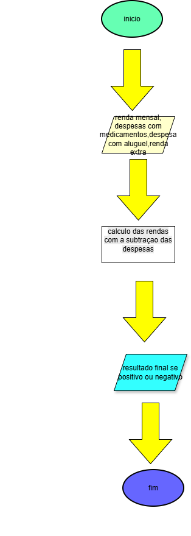

# ABPJ1-ORACULO-MATEMATICO
# 🚀 consumo e ecônomia de energia

> Um projeto academico para aprofundamento em python

## 💻 Sobre
Esse projeto tem como finalidade ajuar o usuario a ter um controle sobre renda e  despesas mensais.

## fluxograma



## 🛠 Tecnologias
As principais ferramentas usadas no projeto:
* **Linguagem:** [Python]

## 🚀 Como Rodar
Siga os passos abaixo para ter uma cópia do projeto rodando na sua 
máquina:

### Pré-requisitos
* Python 3.10 ou superior instalado
* Git instalado

### Instalação
1. Clone o repositório:
   https://github.com/aldenirlopesribeiro/ABPJ1-ORACULO-MATEMATICO.git

2. Acesse a pasta do projeto:

   ```bash
    cd nome-do-seu-repositorio
   
3. Execute o programa:

   ```bash
    python main.py

## 👩‍💻👨‍💻 Autores
Informe:
- Aldenir Lopes – Desenvolvimento Web e Mobile – Python basico.
